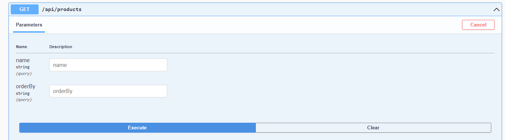

# Desafio Wake Commerce

O projeto consiste em uma API de produtos, oferecendo funcionalidades básicas de gerenciamento de produtos, como criação, busca, ordenação, atualização e deleção.

Foi desenvolvido como uma aplicação ASP.NET Core, utilizando o .NET 8.0 e o Entity Framework para interações com o banco de dados, optou-se pela abordagem "Code-First" para modelagem do banco de dados. O banco de dados escolhido foi o SQLite.

## Tecnologias utilizadas

* Projeto em ASP.NET Corecom .Net 8.0
* Swagger
* Sqlite
* EF Core
* AutoMapper
* FluentValidation
* xUnit
* NUnit

## Como executar

O projeto está configurado com Sqlite para simplificar a execução do projeto.

Para rodar via linha de comando, na raiz do projeto executar:

```
 dotnet run --project .\API\API.csproj
```
O projeto roda as migrations automaticamente e já carrega 5 registros.

O projeto estará disponível em: https://localhost:44395/swagger/index.html

## Como o projeto funciona?

O projeto segue uma estrutura de desenvolvimento utilizando Domain-Driven Design (DDD).

- API: Contém a lógica de inicialização e execução da aplicação, nesse projeto devem ficar os Controllers que definem os endpoints que podem ser utilizados.
- Application: Projeto responsável por fornecer os serviços/funcionalidades que a API pode utilizar do domínio, é uma camada intermediária responsável por controlar a lógica de chamadas ao Domain.
- Domain: Contém as classes de domínio, interfaces de repositório que devem ser implementadas pela camada de infraestrutura, também possui regra de validação para evitar a criação de objetos de dominio inconsistentes.
- Infra.Data: Contém a implementação específica de acordo com as tecnologias utilizadas no projeto para persistência de dados.
- Infra.IoC: Projeto responsável pelas injeções de dependências de banco de dados, repositories e de serviços de domínio com sua implementação.


## Detalhes CRUD:


* No Metod Get products você conseguirá realizar a ordenação por campos e pesquisa por nome (ex: abaixo):



## Migrations

### Gerar novas Migrations

Para gerar novas migrations utilizando o Console do Gerenciador de Pacotes execute:

```
Add-Migration "init" -o Persistence\Migrations
```

### Como executar as Migrations manualmente

Executar as migrations com o comando: Update-Database

## Testes

Para os testes unitários foi utilizado projeto XUnit e para o Integrado foi utilizado NUnit.

## Melhorias Futuras

Implementar tokem JWT e Paginação.
